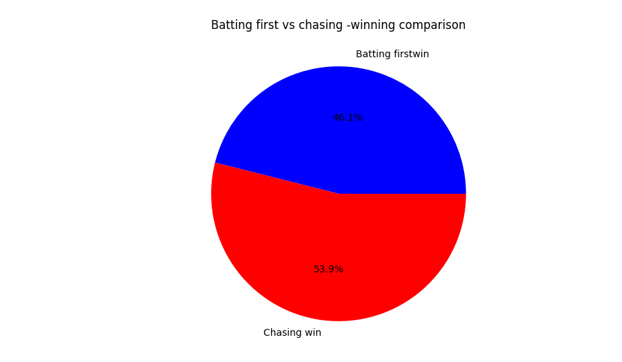

# IPL Data Analysis Project

## 📌 Overview
This project analyzes IPL (Indian Premier League) matches using Python and various data analysis libraries. The goal is to extract insights, visualize data, and provide meaningful statistics about IPL matches, teams, and players.

## 📂 Dataset
The dataset used for this project contains IPL match details, including teams, scores, venues, and player performances.

---

## 🛠️ Technologies Used
- Python 🐍
- Pandas 📊
- NumPy 🔢
- Matplotlib 📈
- Seaborn 🎨

---

## 📥 Clone Repository
To get a copy of this project, run the following command in your terminal:
```sh
git clone https://github.com/your-username/IPL-Data-Analysis.git
```

---

## 🏗️ Installation
To install all necessary dependencies, run:
```sh
pip install -r requirements.txt
```
Or manually install:
```sh
pip install pandas numpy matplotlib seaborn
```

---

## 🚀 Usage
To run the analysis script, use the command:
```sh
python analysis.py
```

---

## 📸 Project Preview
### **1. IPL Match Analysis Visualization**



### **2.Top 10 Most Sucessful Team Performance Graph**


*(Make sure your images are stored in the `images/` folder inside your project directory.)*

---

## 📜 Features
✅ Data cleaning and preprocessing
✅ Match statistics and insights
✅ Team and player performance analysis
✅ Data visualization using Matplotlib & Seaborn

---

## 🤝 Contributing
Contributions are always welcome! Feel free to fork the repo, make changes, and submit a pull request.

---

## 📄 License
This project is licensed under the MIT License.

---

## 💬 Contact
For any queries, feel free to reach out:
- GitHub: [mehtaricha-23](https://github.com/your-username)
- Email: mehtaricha232@gmail.com

